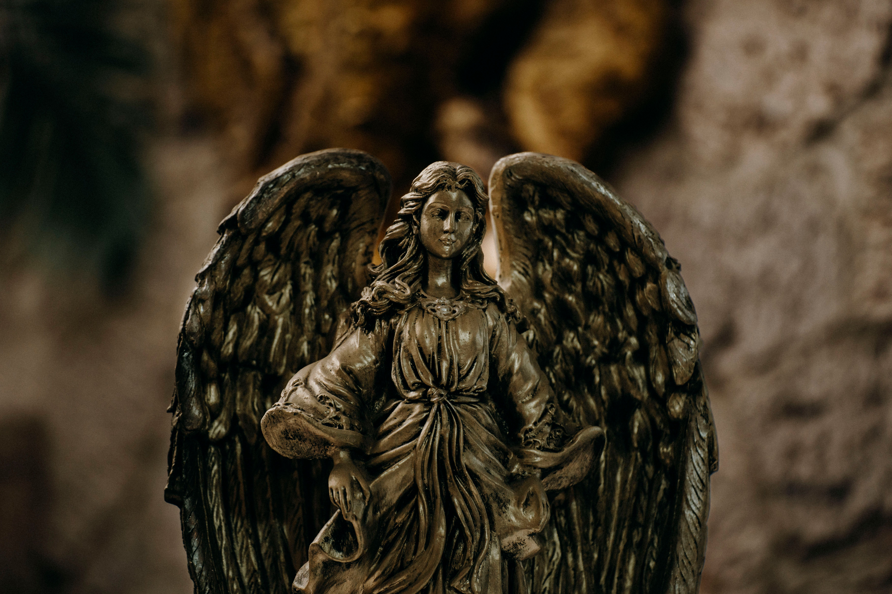

---

title: "Thoughts on Gods, Humans and Life"
date: 2026-06-07
draft: false

description: "A personal reflection on God, atheism, karma, science, love, and humanity's search for meaning."

authors: ["jjk"]

categories: ["Philosophy"]
tags: ["God", "Atheism", "Karma", "Science", "Humanity", "Life"]

featuredImage: "featured.jpg"
featuredImageAlt: "An Idol of an Angel"

showTableOfContents: false
showReadingTime: true
showWordCount: true
math: false
-----------

Is there really a God?

There might not be a God, but humans might need one. Or there might be a God, but humans don't need one.

These are the thoughts that haunted me in my teenage years. Like everyone else, I tried to find answers. I wanted to be on a team, the believers or the atheists. But I found that both sides have their pros and cons. And on top of all the fights between religions, there is another fight between these teams too.

So, I tried to come up with my own theory about all this.

I don't want to believe in God. I want to believe in love. Please don't think I mean "love is God" or "God is love." That's not what I'm saying. Love substitutes God for me. But there might be a thing called karma. Let me explain.

I love science, and I believe in science and love.

There might be some technologically advanced alien race watching over us, because we would probably do the same if we were in their position. After all, science feeds on curiosity. But the idea of an all-knowing higher power seems very unlikely to me, unless we are part of some experiment or something.

And if there is an all-knowing entity, don't they have empathy? Are they robots? Why can't they change events? If someone is watching over us, shouldn't they protect and guide us? Or are they being a bad parent to us?

Why are so many people suffering?

Wars, famine, disasters, terrorists, corporates... the list goes on.

When I look at the world, it feels like the science of life is simply playing out. Nothing else. Just randomness. Entropy.

Everything is random.

Every individual is trying to control this randomness in their own way, contributing to the collective human history and the world as we see it. Every action affects every other person's life in some way. It affects humanity as a whole, and perhaps even the universe itself.

And this idea encapsulates everything—daily life, jobs, politics, world order, love... everything.

Even though I don't believe in God, I believe that doing good gives us good in the future—what we call karma.

Not because of divine intervention, but because there is a logical explanation.

If we do good, it affects us and our surroundings in a positive way. That creates a ripple effect, increasing the probability of good things happening in the future. So, you don't have to believe in God to do good deeds.

Even without an external authority, doing good makes logical sense.

If more people accepted this, we wouldn't need fear-based morality. Instead, goodness would become a conscious and rational choice.

Maybe that's why I might call myself a believer-atheist, or a spiritual atheist, because I believe a thing we cannot perceive, things felt by the soul, not seen by the eye. But I don't think that thing is God, and I don't want to believe in God either.

I hope one day I will be strong enough not to need God to make sense of the world, and still choose love, kindness, and goodness anyway. Because I too have a long way to go to be there, and I will keep on trying…

<em>Featured image by Fernando Capetillo on pexels</em>

