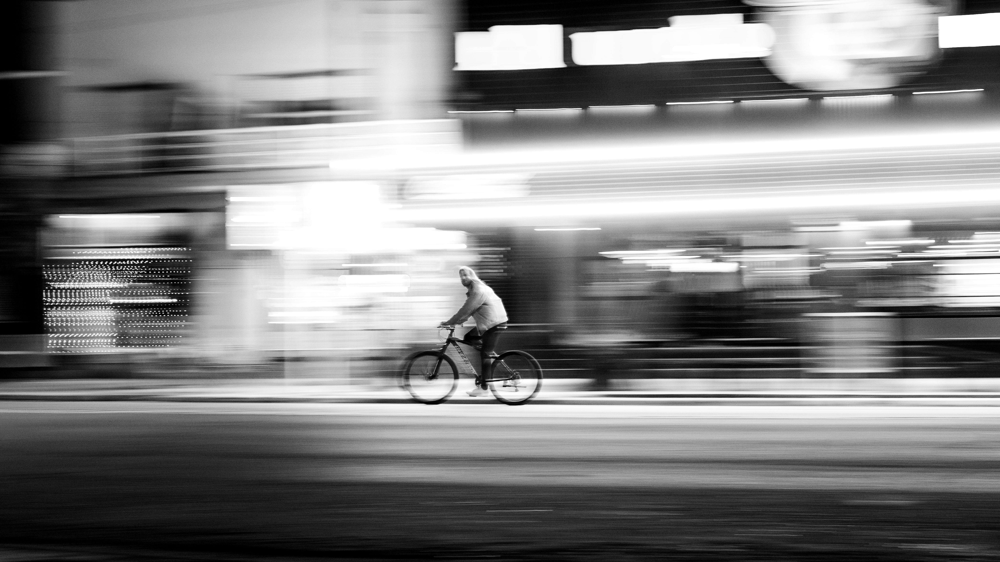

Dreaming out of existence… and back to reality.

The Exordium….  
Recently, I got to travel with my friends. I really needed that at that point in my life because, as everyone says, life is complicated, and I, too, started to feel that sooner or later. Anyways, the journey was good, and as cliche as it seems, I could see that my brain was feeling something different, magical, or philosophical or whatever you call that, and I could feel that I started to see life differently at that moment, realise some things, and my brain became a poet, literally! So if you feel the usage of sentences is a bit different as you read, don't feel surprised, it's me, just me!

The Evolution….  
Somewhere between the noise of everyday life and the silence of distant horizons, I began to fade into something lighter. The roads didn’t ask who I was, and the skies didn’t expect me to be anything more than me. Travel stopped being an escape and became a meditation, each step, each breath, a quiet reminder of how little we truly need to feel alive. The mountains stand still through storms, the trees wave with the wind without resistance, and in their rhythm, I found a kind of truth. Life doesn’t have to be heavy to be meaningful. Hardships will come, like sudden rain or a hailstorm on an open road, unavoidable yet temporary. And when they pass, they leave behind clarity—a softer mind, a calmer heart. In letting go of everything unnecessary. As I was travelling, I was finally finding something real, a simple kind of happiness, a quiet kind of freedom. It felt like dreaming, not to escape life, but to gently exist beyond its noise…like dreaming out of this complex existence!

The Enlightenment….  
The roads didn’t ask who I was, and the skies didn’t expect anything from me. In that stillness, I started noticing something about myself, how often I step back before life even asks me to. How sometimes I reject my own chances, doubt my own path, and walk away before the world has a say. Not because I couldn’t, but because I assumed I shouldn’t.
And maybe reality would have been kinder than I imagined. Maybe it would have opened doors, surprised me, given me something good. But I never waited long enough to see.

The Epiphany ….  
Still… It's okay. Sometimes it happens. We’re human, learning as we go, protecting ourselves in ways we don’t always understand. Travel teaches you that too, that timing isn’t always something to chase. Some roads are meant to be taken only when you’re ready to walk them. Maybe there’s no such thing as too late, no real missed opportunity. Just moments that arrive again, differently, when your heart is finally ready to receive them.
And in that understanding, there’s peace, a quieter way of living, a softer way of trying again. Not rushing, not forcing… just moving when it feels right, and trusting that whatever is meant for you won’t be lost, only delayed until you’re ready to see it.

The Extension….  
I’ve also noticed something else in my life. The things I wanted so badly, or loved so deeply, either became too late to achieve, or I became too afraid to take action, less confident to face them, or they were gone once and for all. And the things I didn’t need- sometimes even things that were harmful, or the things I failed to notice, even if they were important- either hurt me early, disappeared too quickly, or ended before I found closure… often because I thought I had time, or I was too confident. And then there are the “normal” things. The ones I don’t pay much attention to, don’t overthink, don’t attach too much importance to. Those seem to be happening just fine. Maybe they feel okay because I treat them like normal.

The Excavation….  
So I wonder—should I start seeing everything from that same “normal” perspective? Or does “normal” really mean something closer to being unbiased? Maybe it's not like some things are destined to go wrong and other things are destined to go right. Maybe I simply should change the way I see them. The things I desperately want become surrounded by expectations, and the things I ignore become hidden behind assumptions. But the ordinary things sit somewhere in between, free from both. Perhaps that's why they seem easier to live with.

The Epilogue….  
I’m not even sure why I’m thinking this… maybe this is just what a 2 a.m. brain does to someone who usually sleeps at 11 🙂. Sooo…. as someone said in a song…”Oh, my life... You give me breath, yet leave me breathless” , Breathless can mean “oh! I saw a big mountain valley. I'm breathless! or “oh! I'm surrounded by a crowd that I don't belong to. Or maybe I'm not good enough. I should escape. I'm breathless!  
Life is life; it's sometimes up and sometimes down, so just surf along!  
Huh, funny life!

<em>Featured image by Alex Dos Santos on pexels</em>

