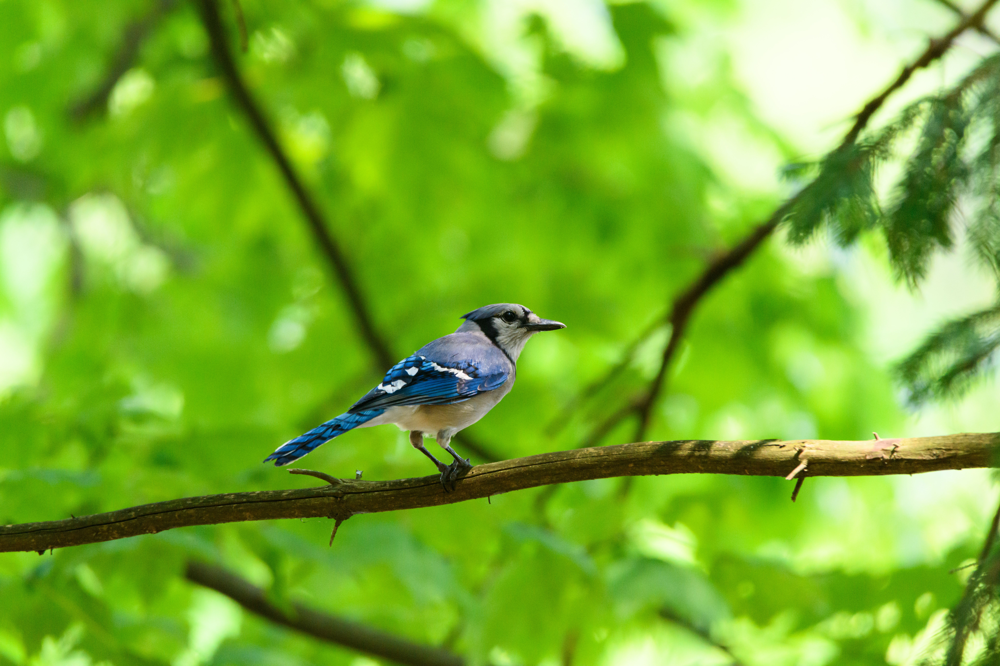

I was trying to design a logo for my website, and I was brainstorming ideas on my own. I wanted to incorporate visuals that represented space, technology, nature, and something personal. Then, while randomly reading about something else, I remembered there was a bird called the **jay**, which sounded similar to my second name. That made me curious, so I started reading about it.

To my surprise, I discovered that there are **green jays**, and since green is my favorite color, I decided to center my logo around one. But what fascinated me even more were the characteristics of the bird itself.

Jays belong to the same family as crows and ravens (Corvidae), one of the most intelligent bird families. Many jays collect seeds, nuts, and especially acorns, then bury them in different locations as food caches. They remember most of these hiding spots months later, and the forgotten acorns often grow into new trees, making jays important forest regenerators. They are also excellent mimics, capable of imitating the calls of other birds, predators like hawks, and even human or mechanical sounds.

Jays act as vigilant sentinels of the forest, emitting loud alarm calls to warn other animals of predators. They also exhibit sophisticated social behaviors, such as re-hiding food if they know another jay has watched them cache it, sometimes even using deceptive tactics to protect their food stores. Curious, bold, and highly observant, they readily explore new environments while balancing social interactions with territorial behavior during breeding seasons. Their intelligence, remarkable memory, vocal versatility, strategic planning, and vital role in seed dispersal make them some of the most fascinating and ecologically important birds in the natural world.

After learning all this, I couldn't stop metaphorically comparing them with the INFJ personality type. Quietly observant and highly intelligent, the jay watches its surroundings with careful attention, plans far ahead by storing food for the future, and even changes its behavior when it knows another bird is watching, revealing an almost uncanny level of strategy and awareness. Rather than being loud or reckless, it is selective, cautious, and purposeful, yet it readily sounds alarm calls to warn other animals of danger, displaying a protective instinct that extends beyond itself. Its remarkable memory, curiosity, and preference for thoughtful action over impulsiveness evoke the image of someone who is reflective, perceptive, and quietly capable.

Since I'm also an INFJ, I felt this was the perfect symbol for my logo. So I designed it around the face of a green jay, with stars and elements of nature in the background. The stars represent space and science in general, while the trees and river symbolize nature, humanity, and the interconnectedness of life—all topics that have always fascinated me.

Another place my research on jays led me was the concept of **coevolutionary mutualism**, and I found it incredibly fascinating.

Jays are excellent examples of coevolutionary mutualism because they share a mutually beneficial relationship with many nut-producing trees, especially oaks. Through coevolution, trees developed large, nutritious seeds to attract jays, while jays evolved remarkable spatial memory and food-caching behaviors that enhance seed dispersal and improve their own survival.

Other examples of coevolutionary mutualism include bees and flowering plants, where bees obtain nectar while pollinating flowers; fig trees and fig wasps, in which wasps pollinate figs while laying their eggs inside the fruit; ants and acacia trees, where ants receive food and shelter in return for defending the tree from herbivores; and mycorrhizal fungi and plant roots, where fungi enhance water and nutrient absorption while receiving sugars from the plant. In every case, both species have evolved traits that benefit one another, strengthening their long-term ecological relationship.

This naturally led me to another thought: perhaps this concept also applies in a philosophical and spiritual sense.

Coevolutionary mutualism can be understood as a relationship in which two people, groups, or even systems help each other grow, with each one's development continuously influencing and shaping the other. A teacher and student, close friends, or partners are examples of this dynamic, where learning, experiences, and perspectives are exchanged, resulting in mutual transformation. Rather than being one-sided, both individuals evolve together through their shared relationship.

On a broader scale, this idea extends to society, culture, and spirituality. Societies shape the values and beliefs of individuals, while individuals, in turn, reshape society through their actions and ideas. Similarly, many spiritual traditions view growth as something that emerges through interconnectedness, where people, communities, and nature continuously influence one another. In this sense, coevolutionary mutualism becomes more than a biological concept—it symbolizes **mutual transformation**, the idea that meaningful relationships enable each participant to become someone they could never have become alone.

<em>Featured image by Jay Brand on pexels</em>

